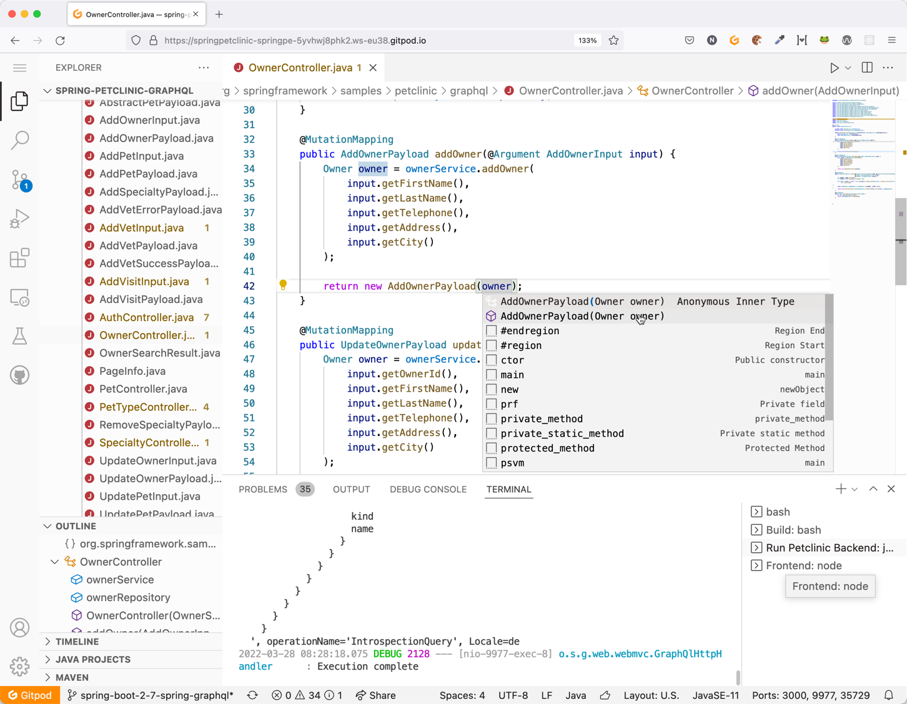
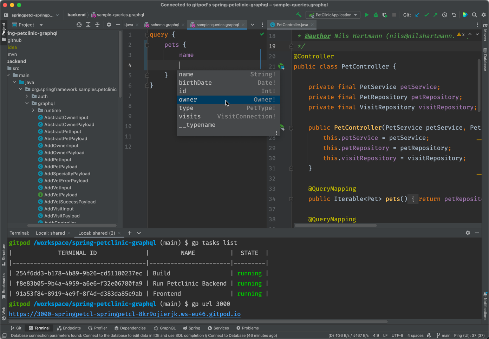

# PetClinic Sample Application using Spring for GraphQL

This PetClinic example uses [Spring for GraphQL](https://github.com/spring-projects/spring-graphql), that is part of Spring Boot [since version 2.7](https://spring.io/blog/2022/05/19/spring-for-graphql-1-0-release).

It implements a [GraphQL API](http://graphql.org/) for the PetClinic and
provides an example Frontend for the API.

Versions currently in use are **Spring Boot 3.2.x** and **Spring for GraphQL 1.2.x**.

[](https://github.com/spring-petclinic/spring-petclinic-graphql/actions/workflows/maven-build.yml)

[](https://gitpod.io/#https://github.com/spring-petclinic/spring-petclinic-graphql)

## Features

Some features that are built in:

* [Annotated Controllers](https://docs.spring.io/spring-graphql/reference/controllers.html) (see `graphql/*Controller`-classes, e.g. `SpecialtyController` and `VetController`)
* Subscriptions via Websockets (see `VisitController#onNewVisit`) including integration test (see `VisitSubscriptionTest`) and examples below  
* Own scalar types (See `PetClinicRuntimeWiringConfiguration` and `DateCoercing`)
* GraphQL Interfaces (GraphQL Type `Person`) and Unions (GraphQL Type `AddVetPayload`), see class `PetClinicRuntimeWiringConfiguration`
* Security: the `/graphql` http and WebSocket endpoints are secured and can only be accessed using a JWT token. More fine grained security is implemented using `@PreAuthorize` (see `VetService`)
  * Example: `addVet` mutation is only allowed for users with `ROLE_MANAGER` 
* Pagination, Filtering and Sorting of results: Implemented using the [Pagination support](https://docs.spring.io/spring-graphql/reference/request-execution.html#execution.pagination) of Spring GraphQL, see `OwnerController`. The result of the `owners` field is a `Connection` object defined in the [Cursor Connection specification](https://relay.dev/graphql/connections.htm).
  * The Apollo client in the React frontend uses the [`relayStylePagination`](https://www.apollographql.com/docs/react/pagination/cursor-based/#relay-style-cursor-pagination) helper function to automatically manage the Client-side cache with new objects read using the `after` cursor query argument. (See `OwnerSearchPage.tsx`)  
* Custom GraphiQL Build, that has its own login screen, since the PetClinic GraphQL is only accessible with a Token
  * see project `petclinic-graphiql`
* Tests: See `test` folder for typical GraphQL endpoint tests, including tests for security
  * The tests are using [Spring Boot TestContains support](https://docs.spring.io/spring-boot/docs/current/reference/htmlsingle/#features.testing.testcontainers) to run the required Postgres database. 
* End-to-end browser tests: see `e2e-tests` folder for some [Playwright](https://playwright.dev/) based end-to-end tests that test the running application in a real browser. Read description below how to run the tests.
* GitHub action workflow:
  * builds and tests the backend
  * starts the backend including database with docker-compose to run the end-to-end-tests
  * (see `.github/workflows/build-app.yml`)

# Running the sample application

You can run the sample application with two ways:

1. The easiest way: run it pre-configured in cloud IDE [GitPod](https://www.gitpod.io/)
2. Run it locally

## Run it in GitPod

To run the application (backend, GraphiQL and React frontend) in GitPod, simply click on the "Open in GitPod" button at the top of this README.

- Note that you need a (free) GitPod account.
- And please make sure that you allow your browser opening new tabs/windows from gitpod.io!

After clicking on the GitPod button, GitPod creates a new workspace including an Editor for you, builds the application and starts
backend and frontend. That might take some time!

When backend and frontend are running, GitPod opens two new browser tabs, one with GraphiQL and one with the
PetClinic backend. For login options, see below "Accessing the GraphQL API"

Note that the workspace is your personal workspace, you can make changes, save files, re-open the workspace at any
time and you can even create git commits and pull requests from it. For more information see GitPod documentation.

In the GitPod editor you can make changes to the app, and after saving the app will be recompiled and redeployed automatically.



### Using IntelliJ with GitPod

Recently GitPod has added support for JetBrain IDEs like IntelliJ. While this support is currenty beta only, you can try it
and open the PetClinic in IntelliJ. Note that in this scenario you're still working on a complete, ready-to-use workspace
in the cloud. Only the IntelliJ _UI_ runs locally at your maching.

Please read the [setup instructions here](https://www.gitpod.io/docs/ides-and-editors/intellij).



## Running locally

The server is implemented in the `backend` folder and can be started either from your IDE (`org.springframework.samples.petclinic.PetClinicApplication`) or
using maven from the root folder of the repository:

```
./mvnw spring-boot:run -pl backend
```

Note: the server runs on port **9977**, so make sure, this port is available.

- Note: you need to have docker installed. `docker-compose` needs to be in your path
- On startup the server uses [Spring Boot docker compose support](https://docs.spring.io/spring-boot/docs/current/reference/htmlsingle/#features.docker-compose) to run the required postgres database

## Running the frontend

While you can access the whole GraphQL API from GraphiQL this demo application also
contains a modified version of the classic PetClinic UI. Compared to the original
client this client is built as a Single-Page-Application using **React** and **Apollo GraphQL**
and has slightly different features to make it a more realistic use-case for GraphQL.

You can install and start the frontend by using [pnpm](https://pnpm.io/):

```
cd ./frontend

pnpm install

pnpm codegen

pnpm start
```

The running frontend can be accessed on [http://localhost:3080](http://localhost:3080).

For valid users to login, see list above.


# Deployment

There are two scenarios: local development environment and "production" environment

**Local development**

In local development:

- the backend runs on http://localhost:9977 (GraphQL API and graphiql)
- the Vite development server for the frontend runs on http://localhost:3080
- the postgres database is started automatically by Spring Boot using the `docker-compose.yml` file in the root folder

In this scenario, the vite server acts also as a reverse proxy, that proxies all requests to `/api`, `/graphql` and `/graphqlws` to the backend server (localhost:9977). The proxy is configured in `frontend/vite.config.ts`

If you like you can run the customized graphiql with its own Vite development server (using `pnpm dev` in `petclinic-graphiql`) that runs on http://localhost:3081. 
This is handy if you want to make changes to GraphiQL. 

**"Production" environment**

In this setup, the backend and frontend process run as docker containers using a docker-compose setup that is described in `docker-compose-petclinic.yml`:

- the backend port is exposed as http://localhost:3091 (GraphQL API and graphiql)
- the nginx for the frontend is exposed as http://localhost:3090
- the postgres database is not exposed outside the container

Here the nginx acts as the proxy to the backend.

You can build the docker images for backend and frontend using the `build-local.sh` scripts. Also, these images are build during the GitHub workflow.

# Accessing the GraphQL API

You can access the GraphQL API via the included customized version of GraphiQL.

The included GraphiQL adds support for login to the original GraphiQL.

You can use the following users for login:

* **joe/joe**: Regular user
* **susi/susi**: has Manager Role and is allowed to execute the `createVet` Mutation

After starting the server, GraphiQL runs on [http://localhost:9977](http://localhost:9977)


## Sample Queries

Here you can find some sample queries that you can copy+paste and run in GraphiQL. Feel free to explore and try more 😊.

**Query** find first 2 owners whose lastname starts with "D" and their pets,
order by lastname and firstname

```graphql
  query {
    owners(
      first: 2
      filter: { lastName: "d" }
      order: [{ field: lastName }, { field: firstName, direction: DESC }]
    ) {
      edges {
        cursor
        node {
          id
          firstName
          lastName
          pets {
            id
            name
          }
        }
      }
      pageInfo {
        hasNextPage
        endCursor
      }
    }
  }
```

The following query should return two items, but we have more then two owners in the database staring with a `d`. Thus, the `pageInfo.hasNextPage`-field returned in the result of the query above is `true` and the `endCursor` points to the last object returned. Using this cursor as `after` we can receive the next batch of Owners:

```graphql
  query {
    owners(
      first: 2
      after: "T18y"
      filter: { lastName: "d" }
      order: [{ field: lastName }, { field: firstName, direction: DESC }]
    ) {
      edges {
        cursor
        node {
          id
          firstName
          lastName
          pets {
            id
            name
          }
        }
      }
      pageInfo {
        hasNextPage
        endCursor
      }
    }
  }
```

Add a new Visit using a **mutation** (can be done with user `joe` and `susi`) and read id and pet of the
new created visit:

```graphql
mutation {
    addVisit(input:{
        petId:3,
        description:"Check teeth",
        date:"2022/03/30",
        vetId:1
    }) {
        newVisit:visit {
            id
            pet {
                id 
                name 
                birthDate
            }
        }
    }
}
```

Add a new veterinarian. This is only allowed for users with `ROLE_MANAGER` and that is `susi`:
```graphql
mutation {
  addVet(input: {
      firstName: "Dagmar", 
      lastName: "Smith", 
      specialtyIds: [1, 3]}) {
      
    ... on AddVetSuccessPayload {
      newVet: vet {
        id
        specialties {
          id
          name
        }
      }
    }
      
    ... on AddVetErrorPayload {
      error
    }
  }
}
```

Listen for new visits using a **Subscription**

This mutation selects the treating veterinarian of the new created Visit and the pet that will be visiting. You can
either create a new Visit using the mutation above or using the frontend application.

```graphql

subscription {
    onNewVisit {
        description
        treatingVet {
            id
            firstName
            lastName
        }
        pet {
            id
            name
        }
    }

}
```

**Note:** In the frontend application, you can open an Owner an see all its pets including their visits. If you add a new visit to one of the pets, in all other browser windows that have the Owner page with that Owner open, the new visit should be added to the table automatically, because the `OwnerPage` React component uses a subscription to update the table contents in the background. 


## Customized GraphiQL

The backend includes a Spring Petclinic-specific customized version of GraphiQL. Compared to GraphiQL that is embedded by default, 
the customized version has a login form so that it can send JWT Authentication header with each request to the GraphQL backend.

Please see the subproject `petclinic-graphiql` for more information.

# End-to-end tests

Inside the folder `e2e-tests` you find some Playwright-based end-to-end tests.

To run the test, please make sure, the backend and the frontend processes are running, as described above.

Then install playwright and all its dependencies including the required browsers by running

```
cd e2e-tests
pnpm install
```

Then you can use `pnpm` to start the test:

* `pnpm test` will execute all tests in headless mode in all three configured browsers (Chrome, Firefox, Safari)

* `pnpm test:ui` opens the tests in [Playwright's UI mode](https://playwright.dev/docs/test-ui-mode)
  * From the started Playwright UI you can individually select which test to run in which browser
  * You can also debug the tests from there
* `pnpm test:headed`: runs the tests in a headed (i.e. visible) browser (by default Chrome).
* `pnpm test:docker-compose` runs the test agains the docker-compose-based setup (localhost:3090/localhost:3091)

## Running, debugging and developing the tests

For writing and running Playwright tests I prefer VS code with the [Playwright extension](https://marketplace.visualstudio.com/items?itemName=ms-playwright.playwright)

But if you want to develop and run the tests in IntelliJ, you can install the [Test Automation Plug-in](https://plugins.jetbrains.com/plugin/20175-test-automation) by Jetbrains.


# Contributing

If you like to help and contribute you're more than welcome! Please open [an issue](https://github.com/spring-petclinic/spring-petclinic-graphql/issues) or a [Pull Request](https://github.com/spring-petclinic/spring-petclinic-graphql/pulls)

Initial implementation of this GraphQL-based PetClinic example: [Nils Hartmann](https://nilshartmann.net), [Twitter](https://twitter.com/nilshartmann) 
